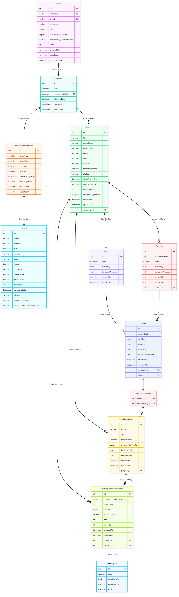
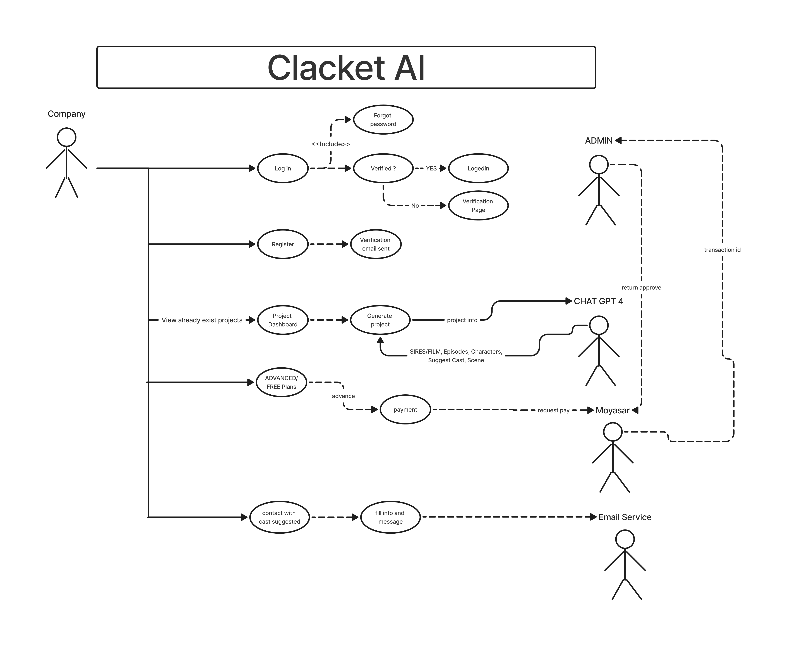

  

### Claquette AI 🎬

Claquette AI is a Spring Boot backend application for an AI-powered platform that helps users (companies) generate film and series projects using artificial intelligence. The system covers subscription management, AI-driven content generation, payment integration, email notifications, and dashboards. Here's a breakdown of the main modules:

---

### 🔐 Authentication & Security

- **JwtUtil**: Handles JWT token generation and validation for secure operations (like password reset). Tokens expire in 15 minutes and are used for password reset links.
- **MyUserDetailsService**: Integrates with Spring Security to load users by email. Throws ApiException if the email is not found.

---

### 👤 User & Company Management

- **WatheqService**: Integrates with Saudi Arabia's Watheq API to validate commercial registration numbers before allowing company registration. If registration is valid and active, a new User and Company are created. Passwords are hashed with BCrypt. A verification code is generated and sent to the user's email.
- **VerificationService**: Manages 6-digit verification codes for account activation. Codes expire after 10 minutes and are stored in memory (ConcurrentHashMap).
- **VerificationEmailService**: Sends account verification emails and contact emails (contact us form). Emails are HTML styled with RTL (Arabic) and branding.
- **PasswordResetService**: Sends password reset links with JWT tokens. Email includes styled HTML with a reset button.

---

### 📽 Projects, Films, and Episodes

- **ProjectService**: CRUD operations for projects (FILM or SERIES). Projects are linked to a Company. Each project has metadata (budget, genre, audience, location, etc.). Handles poster generation via AI or manual upload. Provides dashboard statistics (projects count, budget, characters, breakdowns by genre, type, year, etc.).
- **EpisodeService**: Generates series episodes with scenes using AI. Uses PromptBuilderService to build prompts with project + character data. Calls AiClientService to generate JSON output. Validates character consistency across episodes and scenes. Saves episodes in the DB and allows retrieval.
- **FilmService**: Similar to EpisodeService but for films. Ensures projects are FILM type. Validates characters exist before generation. Generates AI-powered films with consistent characters and structured scenes. Allows retrieving film and its scenes.
- **SceneService**: Manages scenes inside films/episodes. Retrieves scenes for a project (different logic for FILM vs SERIES). Updates scene dialogue. Counts character-scene associations.

---

### 💳 Payments & Subscriptions

- **CompanySubscriptionService**: Manages subscriptions for companies. Plans: FREE (0 SAR, status = FREE_PLAN) and ADVANCED (1999.99 SAR/month). Handles adding subscriptions, renewals, activations/cancellations, status checks (EXPIRED, ACTIVE, PENDING), and subscription dashboard (current plan, history, alerts, statistics). Uses @Scheduled task to check expired subscriptions every minute.
- **PaymentService**: Integrates with Moyasar API for payments. Processes card payments. Saves payment details (transactionId, status, etc.). Confirms subscription once payment status = paid. Sends invoice PDF by email upon success.
- **PdfService & PdfMailService**: Generate PDF invoices (via OpenHTMLToPDF + Thymeleaf) and send them via email. Styled invoice with subscription details. Email includes both a thank-you message and the attached PDF invoice.

---

### 🤖 AI Integration

- **AiClientService**: Primary service to call OpenAI or other LLM API to generate JSON for episodes (structured with scenes and characters), films (full structure with scenes), and posters (AI image generation).
- **JsonExtractor**: Parses AI JSON responses into entities (Episode, Film, Scene, etc.).
- **PromptBuilderService**: Builds dynamic AI prompts based on project descriptions, episode numbers, and characters.

---

### 📊 Dashboards

- **Project Dashboard** → number of projects, budgets, statuses, types.
- **Subscription Dashboard** → active plan, subscription history, alerts, payment statistics.
- **Content Dashboard** → breakdown of series vs films, total episodes, scenes, characters, genres, yearly distribution, budgets.

---

### ✨ Overall Flow

- Company registers → Watheq validation → user + company created → verification email sent.
- User subscribes → chooses plan → payment processed (Moyasar) → subscription activated.
- User creates a project (FILM or SERIES) → can upload or AI-generate a poster.
- AI generates content (episodes/films/scenes) → JSON extracted → stored in DB.
- User manages project (update, delete, view stats).
- Invoices sent for paid subscriptions.
- Dashboards provide insights into projects, budgets, and content.

## 📊 Architecture Diagrams

### 🔷 Class Diagram

### 🔶 Use Case Diagram

---

## 📬 API Documentation

- 🔗 [Postman Documentation](https://documenter.getpostman.com/view/27400894/2sB3HnJezb)
- ## Postman Demo 
🔗 [Postman Demo](https://drive.google.com/file/d/15PzVs43NbvqNMWRE2pBEoknpL4qmxpOa/view?usp=drive_link)

---

## 🎨 Figma Design
- 🔗 [View UI on Figma](https://www.figma.com/proto/912y3Gcb7NKBjKPoYWbb5i/Mflm?node-id=2-2&t=LsRQrFVJE3Ij13X5-0&scaling=min-zoom&content-scaling=fixed&page-id=0%3A1)
- ## Figma Demo 
🔗 [Figma Demo](https://drive.google.com/file/d/1AsDdt8sZPsKgB9dLPmI7Ct2rX41ou8Xv/view?usp=sharing)

---

## 🧰 API Endpoints - Team Contributions

### 👨‍💻 Mohammed Alherz (17 Endpoints)

| #  | Endpoint Description                        | HTTP Method | Endpoint Path |
|----|---------------------------------------------|-------------|---------------|
| 1  | Get all projects (Admin only)               | GET         | `/api/v1/project/get` |
| 2  | Get my projects                             | GET         | `/api/v1/project/my-projects` |
| 3  | Get project dashboard                       | GET         | `/api/v1/project/dashboard` |
| 4  | Get content statistics                      | GET         | `/api/v1/project/content/statistics` |
| 5  | Update project status                       | PUT         | `/api/v1/project/{projectId}/status/{status}` |
| 6  | Generate film                               | POST        | `/api/v1/film/generate-film/{projectId}` |
| 7  | Get project film                            | GET         | `/api/v1/film/project/{projectId}` |
| 8  | Get film scenes                             | GET         | `/api/v1/film/project/{projectId}/scenes` |
| 9  | Get my films                                | GET         | `/api/v1/film/my-films` |
| 10 | Get episode details                         | GET         | `/api/v1/episode/project/{projectId}/episode/{episodeId}` |
| 11 | Get episode scenes                          | GET         | `/api/v1/episode/project/{projectId}/episode/{episodeId}/scenes` |
| 12 | Cancel subscription                         | PUT         | `/api/v1/subscription/cancel-subscription/{subscriptionId}` |
| 13 | Activate subscription                       | PUT         | `/api/v1/subscription/activate-subscription/{subscriptionId}` |
| 14 | Renew subscription                          | PUT         | `/api/v1/subscription/renew` |
| 15 | Get subscription dashboard                  | GET         | `/api/v1/subscription/manage-subscription` |
| 16 | Get project characters                      | GET         | `/api/v1/characters/project/{projectId}` |
| 17 | Get casting recommendations                 | GET         | `/api/v1/casting-recommendation/project/{projectId}` |

### 👨‍💻 Mohammed Shamhani (15 Endpoints)

| #  | Endpoint Description                        | HTTP Method | Endpoint Path |
|----|---------------------------------------------|-------------|---------------|
| 18 | Reset password                              | POST        | `/api/v1/company/reset-password` |
| 19 | Forgot password                             | POST        | `/api/v1/company/forgot-password` |
| 20 | Get all companies (Admin only)              | GET         | `/api/v1/company/companies` |
| 21 | Get my company                              | GET         | `/api/v1/company/my-company` |
| 22 | Register company                            | POST        | `/api/v1/company/register` |
| 23 | Verify email                                | POST        | `/api/v1/company/verify` |
| 24 | Resend verification code                    | POST        | `/api/v1/company/resend` |
| 25 | Update company                              | PUT         | `/api/v1/company/update` |
| 26 | Delete company (Admin only)                 | DELETE      | `/api/v1/company/delete/{companyId}` |
| 27 | Add project                                 | POST        | `/api/v1/project/add` |
| 28 | Update project                              | PUT         | `/api/v1/project/update/{projectId}` |
| 29 | Delete project                              | DELETE      | `/api/v1/project/delete/{projectId}` |
| 30 | Get all subscriptions (Admin only)          | GET         | `/api/v1/subscription/get` |
| 31 | Add subscription                            | POST        | `/api/v1/subscription/add/plan-type/{planType}` |
| 32 | Confirm payment                             | POST        | `/api/v1/pay/confirm/{subscriptionId}/transaction/{transactionId}` |

### 👨‍💻 Hussam - AI Core Specialist (20 Endpoints)

| #  | Endpoint Description                        | HTTP Method | Endpoint Path |
|----|---------------------------------------------|-------------|---------------|
| 33 | Get character count                         | GET         | `/api/v1/characters/character-count` |
| 34 | Generate characters                         | POST        | `/api/v1/characters/generate-characters/{projectId}` |
| 35 | Generate episodes                           | POST        | `/api/v1/episode/generate-episodes/{projectId}` |
| 36 | Get project episodes                        | GET         | `/api/v1/episode/project/{projectId}` |
| 37 | Get project count                           | GET         | `/api/v1/project/project-count` |
| 38 | Get total budget                            | GET         | `/api/v1/project/total-budget` |
| 39 | Get project characters (Analytics)          | GET         | `/api/v1/project/project/{projectId}/characters` |
| 40 | Generate AI poster                          | POST        | `/api/v1/project/generate-poster/{projectId}` |
| 41 | Get poster image                            | GET         | `/api/v1/project/{projectId}/poster.png` |
| 42 | Upload poster                               | PUT         | `/api/v1/project/{projectId}/poster` |
| 43 | Get casting character details               | GET         | `/api/v1/casting-recommendation/project/{projectId}/character/{charId}` |
| 44 | Generate casting recommendations            | POST        | `/api/v1/casting-recommendation/generate-casting/{projectId}` |
| 45 | Get casting information                     | GET         | `/api/v1/cast-info/cast/{castingRecommendationId}` |
| 46 | Contact casting                             | POST        | `/api/v1/cast-info/contact/{castingRecommendationId}` |
| 47 | Get project scenes                          | GET         | `/api/v1/scene/project/{projectId}` |
| 48 | Get scene character count                   | GET         | `/api/v1/scene/project/{projectId}/characters-count` |
| 49 | Upload company photo                        | POST        | `/api/v1/company/photo` |
| 50 | Get company profile photo                   | GET         | `/api/v1/company/profile-photo` |
| 51 | Get subscription payment history            | GET         | `/api/v1/subscription/history-payment` |
| 52 | Generate full screenplay                    | POST        | `/api/v1/ai-interaction/project/{projectId}` |

---

## 👥 Team Contributions Summary

| Developer | Role | Endpoints | Focus Area |
|-----------|------|-----------|------------|
| **Mohammed Alherz** | Lead Developer & Project Manager | 17 | Projects, Films, Dashboards, Business Logic |
| **Mohammed Shamhani** | Authentication & Backend Developer | 15 | Company Management, Authentication, Payments |
| **Hussam** | AI Specialist & Analytics Developer | 20 | AI Content Generation, Analytics, Scene Management |

---
